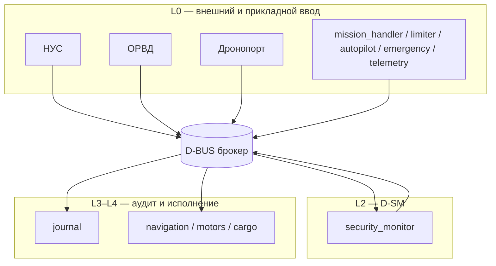

# БТ3 — Активы, цели и предположения безопасности, уровни доверия

**Система:** виртуальный логистический дрон (deliverydron)  
**Нормативная ссылка:** ТЗ С1, базовое требование **БТ3**  
**Дата:** 18 мая 2026  
**Связанные документы:** [`system_description.md`](system_description.md), [`cbpb.md`](../cbpb.md), [`report.md`](../report.md)

---

## 1. Область и границы модели

Модель описывает программный контур **DeliveryBAS** — набор микросервисов на общей шине сообщений (Kafka/MQTT) с центральным **монитором безопасности** (`security_monitor`).

**В scope:** компоненты репозитория `systems/deliverydron`, брокер сообщений (как инфраструктура), внешние контуры НУС, ОРВД, Дронопорт, SITL, DroneAnalytics.

**Вне scope (по ПБ):** криптография на уровне payload сообщений, физическая конструкция грузового отсека, доверенная поставка ПО (ЦБ-8), сертификат системы с подписью Регулятора (БТ8/БТ12).

---

## 2. Перечень активов

Оценка влияния: **Н** — низкое, **С** — среднее, **В** — высокое (для конфиденциальности **К**, целостности **Ц**, доступности **Д**).

| ID | Актив | Описание | К | Ц | Д | Владелец / хранение | Связанные ЦБ |
|----|-------|----------|---|---|---|---------------------|--------------|
| **A-01** | Политики доступа | Правила `(sender, topic, action)`; базовые и аварийные наборы | Н | **В** | С | `security_monitor` (память + `security_monitor.env`) | ЦБ-1…3 |
| **A-02** | Состояние безопасности | Режим `NORMAL` / `ISOLATED`, метаданные переходов | Н | **В** | С | `security_monitor` | ЦБ-1…4 |
| **A-03** | Критичные команды исполнения | `SET_TARGET`, `LAND`, `OPEN`/`CLOSE`, навигация | Н | **В** | **В** | `motors`, `navigation`, `cargo` (только через SM) | ЦБ-1, 5 |
| **A-04** | Полётное задание (миссия) | WPL/JSON: маршрут, геозоны, этапы, `mission_id` | С | **В** | С | `mission_handler`, `autopilot`, `limiter` | ЦБ-3, 5 |
| **A-05** | Состояние груза | Открыт/закрыт, параметры выдачи | Н | **В** | С | `cargo` | ЦБ-2 |
| **A-06** | Журнал безопасности | NDJSON-след: allow/deny, isolation, аварии | С | **В** | С | `journal` (`JOURNAL_FILE_PATH`) | ЦБ-4 |
| **A-07** | Телеметрия полёта | Координаты, высота, батарея, агрегат состояния | С | С | С | `telemetry`, внешние НУС/ОРВД | ОФ4, БТ10 |
| **A-08** | Идентичность отправителя | Поле `sender` в сообщениях шины | Н | **В** | Н | Все топики | ЦБ-1…3 |
| **A-09** | Конфигурация компонентов | Топики, таймауты, флаги (`config.FromEnv`) | Н | **В** | С | Переменные окружения / `.env` | ЦБ-1 |
| **A-10** | Канал шины сообщений | Топики `deliverydron.*`, транспорт Kafka/MQTT | С* | С* | **В** | Брокер (исключение по БТ12) | ЦБ-1…3 |
| **A-11** | Интеграция ОРВД | Регистрация, разрешение миссии, телеметрия, завершение | С | **В** | С | `limiter` ↔ OpBD | ЦБ-3, 6 |
| **A-12** | Интеграция Дронопорт | Взлёт/посадка/зарядка на базе | С | С | С | `emergency` ↔ DronePortGCS | ОФ2 |
| **A-13** | Поток команд НУС | `LOAD_MISSION`, управление миссией | С | **В** | С | `mission_handler` | ОФ1, ЦБ-3 |
| **A-14** | Аналитика (DroneAnalytics) | Копии телеметрии и событий | С | С | Н | Внешний сервис | БТ10, БТ11 |

\*К/Ц канала — по **ПБ-3** (TLS/VPN инфраструктуры), не в коде БАС.

---

## 3. Цели безопасности (ЦБ)

Используются две согласованные формулировки: **краткая ЦБПБ** (эксплуатация message-control) и **расширенная** (отчёт команды, трассировка в QA).

### 3.1 ЦБПБ (текущий scope ДВБ)

| ID | Формулировка | Реализация / контроль |
|----|--------------|------------------------|
| **ЦБ-1** | К критичным компонентам допускаются только аутентичные и авторизованные сообщения | `security_monitor`: policy + `IsTrustedSender` |
| **ЦБ-2** | Все межкомпонентные критичные операции авторизованы | Mediation-only: `proxy_request` / `proxy_publish` |
| **ЦБ-3** | Обрабатываются только разрешённые и корректно адресованные сообщения | Deny-by-default; отклонение в SM |
| **ЦБ-4** | Исполнительные `navigation`, `motors`, `cargo` выполняют только авторизованные операции | Команды только от `security_monitor` |

### 3.2 Расширенные цели (продукт / интеграции)

| ID | Формулировка | Статус в системе |
|----|--------------|------------------|
| **ЦБ-5** | Соблюдение ограничений миссии; fail-safe при нарушении | `limiter` + `emergency` |
| **ЦБ-6** | Ц/П/К обмена с ОРВД/НУС/Дронопорт | Частично: интеграции + **ПБ** на TLS; без крипто на шине |
| **ЦБ-7** | Удержание груза (физический уровень) | **ПБ** / вне ПО |
| **ЦБ-8** | Происхождение и целостность ПО ДВБ | Не реализовано (процесс поставки) |

---

## 4. Предположения безопасности (ПБ)

| ID | Предположение |
|----|----------------|
| **ПБ-1** | Бизнес-валидность payload (геометрия маршрута, физические лимиты) обеспечивается внешними доверенными контурами (НУС, ОРВД). |
| **ПБ-2** | Аварийная детекция/реакция (`limiter`, `emergency`) верифицируется и допускается вне message-control TCB в данной постановке ЦБПБ. |
| **ПБ-3** | Конфиденциальность, целостность и подлинность транспорта (шина, WAN) обеспечиваются инфраструктурой (TLS/VPN, защищённый MQTT/Kafka). |
| **ПБ-4** | Внешние системы (ОРВД, НУС, Дронопорт) используют согласованные форматы и атрибуты полномочий. |
| **ПБ-5** | Брокер сообщений и SITL — вспомогательные/инфраструктурные контуры; сертификат безопасности на них не требуется (БТ12). |
| **ПБ-6** | Регулятор/АСЦ для сертификата системы — внешняя роль; в учебной поставке допускается отсутствие подписанного артефакта (БТ8/БТ12). |

---

## 5. Домены безопасности и уровни доверия

### 5.1 Карта доменов

| ID домена | Компонент / контур | Роль | Уровень доверия | Входит в ДВБ* |
|-----------|-------------------|------|-----------------|---------------|
| **D-EXT** | НУС, ОРВД, DronePort, GCS | Внешний ввод | **L0** | Нет |
| **D-APP** | `mission_handler`, `autopilot`, `limiter`, `emergency`, `telemetry` | Прикладная логика | L0→L1 после SM | Нет** |
| **D-SM** | `security_monitor` | PEP / reference monitor | **L2** | Да |
| **D-AUD** | `journal` | Аудит, неизменяемый след | **L3** | Да |
| **D-INF** | `component`, `config` | Общие механизмы TCB | L2–L3 | Да |
| **D-EXE** | `navigation`, `motors`, `cargo` | Доверенные исполнители | **L4** | Да |
| **D-BUS** | Kafka / MQTT / `bus` | Медиатор (инфраструктура) | L0 (транспорт) | Частично*** |
| **D-SITL** | SITL | Симуляция / стенд | Вне сертификата | Нет |
| **D-AN** | DroneAnalytics | Внешняя аналитика | L0 | Нет |

\*ДВБ = доверенная вычислительная база в постановке [`system_description.md`](system_description.md) §2.3.  
\*\*Вынесены в ПБ-2 для целей message-control; функционально критичны для ОФ2/ОФ3.  
\*\*\*Адаптеры `bus/kafka`, `bus/mqtt` — сторонние зависимости; ядро `bus` (интерфейс, `Respond`) — в составе зависимостей ДВБ.

### 5.2 Шкала уровней доверия (L0–L4)

| Уровень | Смысл | Типовые угрозы | Механизмы контроля |
|---------|-------|----------------|-------------------|
| **L0** | Недоверенный ввод | Подмена `sender`, инъекция команд | Централизованная проверка в **D-SM** |
| **L1** | Условно доверенный канал | Злоупотребление разрешённым правилом | Точное `(sender, topic, action)` + режим `ISOLATED` |
| **L2** | Управление состоянием безопасности | Обход изоляции | `ISOLATION_START/END`, аварийные политики, watchdog |
| **L3** | Доверенный аудит | Потеря/подмена следов | Только `LOG_EVENT` от `security_monitor`; NDJSON append |
| **L4** | Доверенное исполнение | Обход policy-gate | Приём команд только от **D-SM** |

### 5.3 Правила перехода между доменами (БТ1, БТ2)

1. Каждый прикладной компонент (**D-APP**) и исполнитель (**D-EXE**) — отдельный домен с собственным топиком.
2. Междоменное взаимодействие **критичных** операций — **только** через **D-BUS** и с проверкой в **D-SM** (`proxy_*`).
3. Прямых подписок «в обход» SM между **D-APP** и **D-EXE** в штатной конфигурации нет.
4. **D-EXT** → **D-APP**: вход с **L0**; повышение доверия — только после политики SM.

---

## 6. Угрозы по ключевым активам (кратко)

| Актив | Угроза | Последствие | Контроль |
|-------|--------|-------------|----------|
| A-01, A-02 | Подмена политик / принудительный NORMAL | Несанкционированный доступ | CRUD политик только от доверенного администратора; тесты deny |
| A-03, A-05 | Команда моторов/cargo не от SM | Несанкционированное движение/выдача груза | `IsTrustedSender(security_monitor)` |
| A-04 | Загрузка чужой/запрещённой миссии | Нарушение воздушного пространства | ОРВД в `limiter`; валидация WPL в `mission_handler` |
| A-06 | Удаление/подмена журнала | Потеря доказательств | Append-only файл; LOG_EVENT только от SM |
| A-08 | Спуфинг `sender` | Обход политики | Exact match sender; без prefix-trust |
| A-10 | Прослушивание/подмена на шине | Утечка / инъекция | **ПБ-3** TLS; учебный проект без E2E крипто в payload |
| A-11…A-13 | Компрометация внешнего контура | Ложные разрешения | Моки/интеграционные тесты; ПБ на внешние системы |

---

## 7. Трассировка: актив → домен → ЦБ

| Актив | Домен-хранитель | ЦБ |
|-------|-----------------|-----|
| A-01, A-02 | D-SM | ЦБ-1…3 |
| A-03, A-05 | D-EXE (через D-SM) | ЦБ-1, 4, 5 |
| A-04 | D-APP + D-SM | ЦБ-3, 5 |
| A-06 | D-AUD | ЦБ-4 |
| A-07 | D-APP + внешние | ОФ4, БТ10 |
| A-08 | Все (проверка D-SM) | ЦБ-1…3 |
| A-09 | D-INF | ЦБ-1 |
| A-10 | D-BUS | ЦБ-1…3 (транспорт) |
| A-11…A-14 | D-EXT / D-AN | ЦБ-3, 6; БТ10–11 |

---

## 8. Соответствие БТ3 (чеклист)

| Пункт БТ3 | Артефакт в документе |
|-----------|----------------------|
| Перечислены активы | §2 (таблица A-01…A-14) |
| Проанализированы (угрозы) | §6 |
| Сформулированы цели безопасности | §3 |
| Сформулированы предположения | §4 |
| Определены уровни доверия доменов | §5 |

---

## 9. Поддержание актуальности

При добавлении компонента или внешней интеграции обновить: §2 (актив), §5.1 (домен), §6 (угроза), политики в `security_monitor/security_monitor.env`, раздел 2 в [`system_description.md`](system_description.md).
