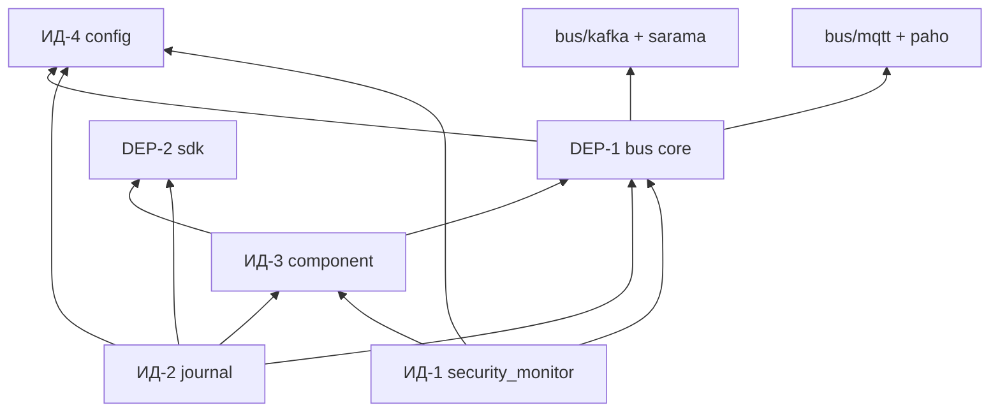

# БТ6 — Покрытие тестами и анализ уязвимостей зависимостей (домены целостности)

**Система:** виртуальный логистический дрон (deliverydron)  
**Нормативная ссылка:** ТЗ С1, базовое требование **БТ6**  
**Дата замера:** 18 мая 2026  
**Связанные документы:** [`bts3_assets_and_trust_model.md`](bts3_assets_and_trust_model.md), [`system_description.md`](system_description.md) §4

---

## 1. Scope БТ6

**БТ6** распространяется на **доверенные домены безопасности, повышающие целостность данных** — подсистемы, которые обеспечивают:

- целостность решений о доступе (политики, режим безопасности);
- целостность конфигурации и формата сообщений;
- целостность аудита (журнал, пересылка в аналитику);
- доверенную доставку запросов (прокси к исполнителям).

### 1.1 Состав доменов целостности (ИД — integrity domains)

| ID | Пакет / компонент | Назначение для целостности |
|----|-------------------|----------------------------|
| **ИД-1** | `security_monitor` | PEP: allow/deny, `NORMAL`/`ISOLATED`, proxy |
| **ИД-2** | `journal` | Append-only аудит, severity, analytics events |
| **ИД-3** | `component` | `ProxyClient`, `AuditLogger`, `IsTrustedSender`, loop |
| **ИД-4** | `config` | Канонические топики, префиксы, параметры брокера |

### 1.2 Зависимости ИД (включая для замера покрытия)

Прямые **внутренние** зависимости, без которых ИД не собираются:

| ID | Пакет | Использование ИД |
|----|-------|------------------|
| **DEP-1** | `bus` (ядро: `bus.go`, `factory.go`, `Respond`) | Транспорт сообщений |
| **DEP-2** | `sdk` | Формат сообщений; HTTP-клиент DroneAnalytics в `journal` |

**Не входят в замер покрытия ИД** (отдельные адаптеры, см. §4):

- `bus/src/kafka` → `github.com/IBM/sarama`
- `bus/src/mqtt` → `github.com/eclipse/paho.mqtt.golang`

В **продакшен-сборке** бинарники компонентов линкуют адаптеры через `bus.New()`; уязвимости этих модулей учитываются в §4 отдельно.

---

## 2. Покрытие тестами (порог ≥ 70%, с зависимостями)

### 2.1 Методика

- Метрика: **покрытие операторов (statements)**.
- Объединение профилей: интеграционные (`go test ./tests`) + модульные (`*_test.go` в пакетах ИД и DEP).
- Инструмент слияния: `gocovmerge` (`github.com/wadey/gocovmerge`).
- `coverpkg`: все пакеты из §1.1 и §1.2 (ИД + DEP).

### 2.2 Результаты (18 мая 2026)

| Пакет | Покрытие (statements)* | Порог БТ6 | Статус |
|-------|------------------------|-----------|--------|
| `security_monitor/src` | **87.3%** | ≥ 70% | ✅ |
| `journal/src` | **81.2%** | ≥ 70% | ✅ |
| `component/src` | **80.2%** | ≥ 70% | ✅ |
| `config/src` | **98.8%** | ≥ 70% | ✅ |
| `bus/src` (ядро) | **100.0%** | ≥ 70% | ✅ |
| `sdk/src` | **91.6%** | ≥ 70% | ✅ |
| **Совокупно (ИД + DEP)** | **87.5%** | ≥ 70% | ✅ |

\*Источник: объединённый профиль `coverpkg` = ИД-1…4 + DEP-1…2; детальная разбивка по всей системе — [`system_description.md`](system_description.md) §4.

**Вывод по БТ6 (покрытие):** требование **≥ 70% с учётом зависимостей** для доменов целостности **выполнено**.

### 2.3 Воспроизведение

```bash
export PATH="$HOME/go/bin:$PATH"

INTEGRITY_PKGS="github.com/AMCP-Drones/drones/systems/deliverydron/security_monitor/src,\
github.com/AMCP-Drones/drones/systems/deliverydron/journal/src,\
github.com/AMCP-Drones/drones/systems/deliverydron/component/src,\
github.com/AMCP-Drones/drones/systems/deliverydron/config/src,\
github.com/AMCP-Drones/drones/systems/deliverydron/bus/src,\
github.com/AMCP-Drones/drones/systems/deliverydron/sdk/src"

go test ./tests -count=1 -timeout 120s \
  -coverprofile=/tmp/cov_int_bts6.out -covermode=count -coverpkg="$INTEGRITY_PKGS"

go test ./bus/src ./component/src ./config/src ./sdk/src ./journal/src \
  -count=1 -timeout 60s \
  -coverprofile=/tmp/cov_unit_bts6.out -covermode=count -coverpkg="$INTEGRITY_PKGS"

gocovmerge /tmp/cov_int_bts6.out /tmp/cov_unit_bts6.out > coverage_bts6.out
go tool cover -func=coverage_bts6.out | tail -1
```

Запуск регрессии (без e2e):

```bash
go test $(go list ./... | grep -v e2e) -count=1 -timeout 120s
```

### 2.4 Непокрытые фрагменты (для сопровождения)

| Область | Файл / функция | Комментарий |
|---------|----------------|-------------|
| Watchdog SM | `handleSafetyHeartbeat` | 0% — срабатывает только при `SAFETY_WATCHDOG_ENABLED=1` |
| MQTT/Kafka адаптеры | `bus/src/kafka`, `bus/src/mqtt` | Вне `coverpkg` ИД; покрываются e2e/стендом |

---

## 3. Зависимости: состав и граф

### 3.1 Прямые модули Go (`go.mod`)

| Модуль | Версия | Связь с ИД |
|--------|--------|------------|
| `github.com/IBM/sarama` | v1.43.3 | Только `bus/kafka` (продакшен-брокер) |
| `github.com/eclipse/paho.mqtt.golang` | v1.4.3 | Только `bus/mqtt` |
| `golang.org/x/net` | v0.28.0 | Транзитивно (MQTT) |
| `golang.org/x/crypto` | v0.26.0 | Транзитивно (Kafka/SASL) |
| Остальные в `go.mod` | indirect | Транзитивно через Sarama/Paho |

**ИД-1…ИД-4, DEP-1 (ядро `bus`), DEP-2 (`sdk`):** только стандартная библиотека Go и внутренние пакеты проекта — **сторонних runtime-зависимостей в исходниках нет**.

### 3.2 Граф (упрощённо)



---

## 4. Анализ уязвимостей

### 4.1 Метод

| Шаг | Инструмент / источник | Дата |
|-----|----------------------|------|
| 1 | `govulncheck ./...` (Go Vulnerability Database) | 18.05.2026 |
| 2 | Ручной просмотр `go.mod` / `go.sum` | 18.05.2026 |
| 3 | Оговорка ТЗ (учебный проект) | Допускается документированное исключение + план устранения |

Команда:

```bash
go install golang.org/x/vuln/cmd/govulncheck@latest
govulncheck ./...
```

Версия Go при сканировании: **go1.26.3**.

### 4.2 Результаты `govulncheck` (затрагивают код проекта)

| ID | Модуль | Установлено | Исправлено в | Затронутый код | Критичность для ИД |
|----|--------|-------------|--------------|----------------|-------------------|
| **GO-2025-4173** | `github.com/eclipse/paho.mqtt.golang` | v1.4.3 | **v1.5.1** | `bus/src/mqtt` (публикация/подписка) | Низкая для **юнит-тестов ИД** (MemoryBus); **средняя** для продакшен MQTT |
| **GO-2025-3503** | `golang.org/x/net` | v0.28.0 | **v0.36.0** | Транзитивно через MQTT connect/proxy | Та же |

**Итог сканера:** «Your code is affected by **2** vulnerabilities from **2** modules.»  
Дополнительно в графе зависимостей обнаружено **10** уязвимостей в модулях, **не вызываемых** текущим кодом (транзитив Sarama и др.) — см. полный лог `govulncheck -show verbose`.

### 3.3 Соответствие правилу «запрещены пакеты с известными уязвимостями»

| Контур | Сторонние пакеты с CVE в трассировке | Решение |
|--------|--------------------------------------|---------|
| **ИД + DEP (ядро)** | Нет | ✅ Соответствует |
| **Продакшен-брокер (MQTT)** | Paho GO-2025-4173 | ⚠️ Исключение учебного проекта (§4.4) + рекомендация обновления |
| **Продакшен-брокер (Kafka)** | Косвенно `x/net` через MQTT-стек в отчёте; Sarama — отдельные неэксплуатируемые CVE | Мониторинг; обновление indirect |

### 4.4 Оформленное исключение (учебный проект, оговорка ТЗ)

**Обоснование:** в интеграционных и модульных тестах доменов целостности используется `testutil.MemoryBus` — **без** вызова Paho/Kafka. Покрытие БТ6 подтверждено на этом контуре. Продакшен-стенд с Mosquitto использует MQTT-адаптер.

**Компенсирующие меры:**

1. Документирование CVE и фиксированных версий (настоящий артефакт).
2. Ограничение эксплуатации: брокер в доверенном сегменте (**ПБ-3**), без публичного MQTT.
3. План устранения (рекомендуется до промышленной поставки):

```bash
# В go.mod (пример целевых версий)
go get github.com/eclipse/paho.mqtt.golang@v1.5.1
go get golang.org/x/net@v0.36.0
go mod tidy
govulncheck ./...
go test $(go list ./... | grep -v e2e) -count=1
```

4. При недоступности обновления — статический разбор затронутых путей (`bus/src/mqtt/bus.go`) и проверка, что длина MQTT payload в эксплуатации < 65535 байт (mitigation для GO-2025-4173).

### 4.5 Зависимости ИД — итоговая таблица

| Зависимость | Тип | Известные CVE в используемой версии | В коде ИД вызывается? | Статус |
|-------------|-----|-------------------------------------|------------------------|--------|
| Go stdlib | runtime | По GVD на дату скана — см. `govulncheck` | Да | Мониторинг |
| `sdk` | внутренняя | — | Да | ✅ |
| `bus` core | внутренняя | — | Да | ✅ |
| `sarama` | внешняя | Не в трассировке вызовов ИД | Только kafka-адаптер | ✅ для ИД |
| `paho.mqtt.golang` | внешняя | GO-2025-4173 | Только mqtt-адаптер | ⚠️ исключение §4.4 |
| `golang.org/x/net` | транзитивная | GO-2025-3503 | Через MQTT | ⚠️ исключение §4.4 |

---

## 5. Связь с полным ДВБ (справочно)

Полный **ДВБ** (message-control + исполнители) из [`system_description.md`](system_description.md):  
`security_monitor`, `component`, `config`, `journal`, `navigation`, `motors`, `cargo` — совокупное покрытие **~80.7%** (`report.md`), все пакеты **≥ 60%** (БТ5).

Настоящий документ сужает scope до **доменов целостности данных** (БТ6), порог **70%**.

---

## 6. Чеклист соответствия БТ6

| Пункт БТ6 | Статус | Ссылка |
|-----------|--------|--------|
| Выделены домены, повышающие целостность данных | ✅ | §1.1 |
| Покрытие ≥ 70% **с зависимостями** | ✅ (87.5%) | §2 |
| Зависимости перечислены | ✅ | §3 |
| Анализ на известные уязвимости | ✅ | §4 (`govulncheck`) |
| Нет неучтённых уязвимых пакетов в ИД | ✅ | §4.5 |
| Исключения для учебного проекта оформлены | ✅ | §4.4 |

---

## 7. Поддержание актуальности

При изменении `go.mod`, состава ИД или тестов:

1. Повторить §2.3 и обновить таблицу §2.2.
2. Запустить `govulncheck ./...` и обновить §4.2.
3. Синхронизировать пороги с [`system_description.md`](system_description.md) §4.
