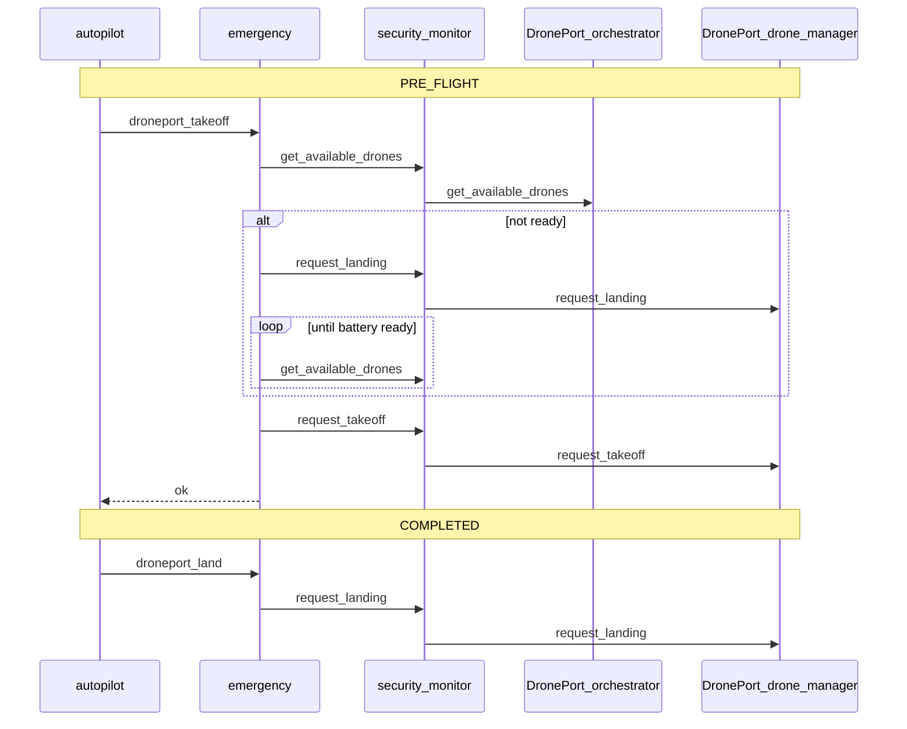

# DronePort integration for deliverydron

Date: 2026-05-18 (rev. 1 — DronePortGCS API sync)

**Status:** DronePort integration aligned with **DronePortGCS** (`../DronePortGCS`). **Emergency** owns the full lifecycle: preflight `request_landing` (if needed) → charge readiness via orchestrator `get_available_drones` → `request_takeoff`; post-mission `request_landing` on `COMPLETED`. Autopilot never calls `DRONEPORT_TOPIC` directly.

See also: [ORVD integration](orvd_integration.md) (preflight order: ORVD takeoff, then DronePort).

---

## 1. Architecture

| Item | Choice |
|------|--------|
| Context diagram | `dronePort → deliverydron.emergency` |
| External owner | **emergency** only (via `proxy_request`) |
| Preflight caller | **autopilot** → `emergency` `droneport_takeoff` |
| Post-mission | **autopilot** → `emergency` `droneport_land` |



---

## 2. DronePortGCS external API (used by deliverydron)

### 2.1 `drone_manager` — `${DRONEPORT_TOPIC}` (default `v1.drone_port.1.drone_manager`)

| Action | Payload | Success response |
|--------|---------|------------------|
| `request_landing` | `drone_id`, `model`, optional `battery` | `approved: true`, `port_id`, `drone_id` |
| `request_takeoff` | `drone_id` (required) | `approved: true`, `battery`, `port_id`, `port_coordinates` |

**DronePort rules (code):**

- Takeoff requires drone in registry with **battery > 60%**.
- Landing with `battery < 100` auto-starts charging (internal `start_charging`).
- Takeoff frees the port and publishes `sitl-drone-home` (deliverydron does not consume this topic today).

### 2.2 `orchestrator` — `${DRONEPORT_ORCHESTRATOR_TOPIC}` (default `v1.drone_port.1.orchestrator`)

| Action | Payload | Success response |
|--------|---------|------------------|
| `get_available_drones` | `{}` | `drones: [...]` — entries with `status == ready` and sufficient battery |

Used to poll charge completion without calling `request_takeoff` (which would release the port).

### 2.3 README vs code (DronePortGCS)

| README | Code |
|--------|------|
| `request_departure` | **`request_takeoff`** |
| `request_charging` on drone_manager | **Not implemented** — charging starts from `request_landing` |

---

## 3. deliverydron behaviour

### 3.1 Preflight (`droneport_takeoff`)

Implemented in `emergency/src/droneport_client.go` → `runPreflight`:

1. If `EMERGENCY_DRONEPORT_MOCK_SUCCESS=1` → approve (stub).
2. If `get_available_drones` shows this drone ready (battery > `DRONEPORT_MIN_BATTERY_TAKEOFF`, default 61) → skip landing.
3. Else `request_landing` with `DRONEPORT_LANDING_BATTERY_DEFAULT` (or payload override).
4. Poll orchestrator once per preflight tick; return `{pending: true}` until ready or `DRONEPORT_CHARGE_TIMEOUT_S` (default 120s).
5. `request_takeoff` → phase `DEPARTED`.

Autopilot treats `pending: true` like ORVD `PENDING` (keeps `PRE_FLIGHT` until cleared).

### 3.2 Post-mission (`droneport_land`)

On `COMPLETED`, autopilot calls `droneport_land` **before** `orvd_complete`, with optional `battery` / `battery_pct` from last nav state.

### 3.3 Session phases (`emergency` `get_state`)

| Phase | Meaning |
|-------|---------|
| `DISABLED` | No `DRONEPORT_TOPIC` configured |
| `NOT_REGISTERED` | Initial / after reset |
| `CHARGING` | Landed, waiting for orchestrator readiness |
| `READY` | Battery sufficient, not yet departed |
| `DEPARTED` | Takeoff approved this mission |

### 3.4 Inbound `droneport_event`

Policy and handler exist; **DronePortGCS does not publish** this action today. Handler journals `DRONEPORT_EVENT_RECEIVED` only.

---

## 4. Security policies

In `security_monitor/security_monitor.env` (keep in sync with `src/security_monitor/`):

| sender | topic | action |
|--------|-------|--------|
| `autopilot` | `${SYSTEM_NAME}.emergency` | `droneport_takeoff`, `droneport_land`, `get_state` |
| `emergency` | `${DRONEPORT_TOPIC}` | `request_landing`, `request_takeoff` |
| `emergency` | `${DRONEPORT_ORCHESTRATOR_TOPIC}` | `get_available_drones` |
| `droneport` | `${SYSTEM_NAME}.emergency` | `droneport_event` |

`${DRONEPORT_ORCHESTRATOR_TOPIC}` is expanded in `security_monitor.New()`.

---

## 5. Environment variables

| Variable | Service | Default | Purpose |
|----------|---------|---------|---------|
| `DRONEPORT_TOPIC` | emergency, security_monitor | — | Drone manager API |
| `DRONEPORT_ORCHESTRATOR_TOPIC` | emergency, security_monitor | `v1.drone_port.1.orchestrator` | Readiness polling |
| `DRONEPORT_DRONE_ID` | emergency | instance id / `drone_001` | Drone id in payloads |
| `DRONEPORT_DRONE_MODEL` | emergency | `deliverydron` | Landing registration |
| `DRONEPORT_LANDING_BATTERY_DEFAULT` | emergency | `95` | Reported battery on landing |
| `DRONEPORT_MIN_BATTERY_TAKEOFF` | emergency | `61` | Match DronePort > 60 rule |
| `DRONEPORT_CHARGE_POLL_INTERVAL_S` | emergency | `1` | Reserved for future use |
| `DRONEPORT_CHARGE_TIMEOUT_S` | emergency | `120` | Max charge wait in preflight |
| `EMERGENCY_DRONEPORT_MOCK_SUCCESS` | emergency | `0` | Skip all DronePort RPC (CI) |
| `EMERGENCY_TOPIC` | autopilot | broker topic | Target for `droneport_*` |

---

## 6. Testing

```bash
go test ./tests -run Droneport -count=1
go test ./tests -count=1
```

| File | Coverage |
|------|----------|
| `tests/droneport_mock_test.go` | Stateful DronePort mock |
| `tests/module_droneport_test.go` | Mock bypass, full preflight, charging pending, deny, post-mission land |

---

## 7. File map

| File | Role |
|------|------|
| `emergency/src/droneport_client.go` | Lifecycle, orchestration, parsing |
| `emergency/src/droneport.go` | Config, unwrap helpers |
| `emergency/src/emergency.go` | Handlers, session state |
| `autopilot/src/autopilot.go` | Preflight pending, `droneport_land` on complete |
| `security_monitor/src/security_monitor.go` | `${DRONEPORT_ORCHESTRATOR_TOPIC}` substitution |

---

## 8. Non-goals

- GCS / NUS mission planning (separate system in DronePortGCS repo).
- Internal DronePort topics (`registry`, `port_manager`, `charging_manager`).
- `request_charging` on drone_manager (not in DronePort code).
- Subscribing to `sitl-drone-home`.

Run DronePort externally (no compose profile in deliverydron); use mocks or point `DRONEPORT_*` at a live DronePort stack.
