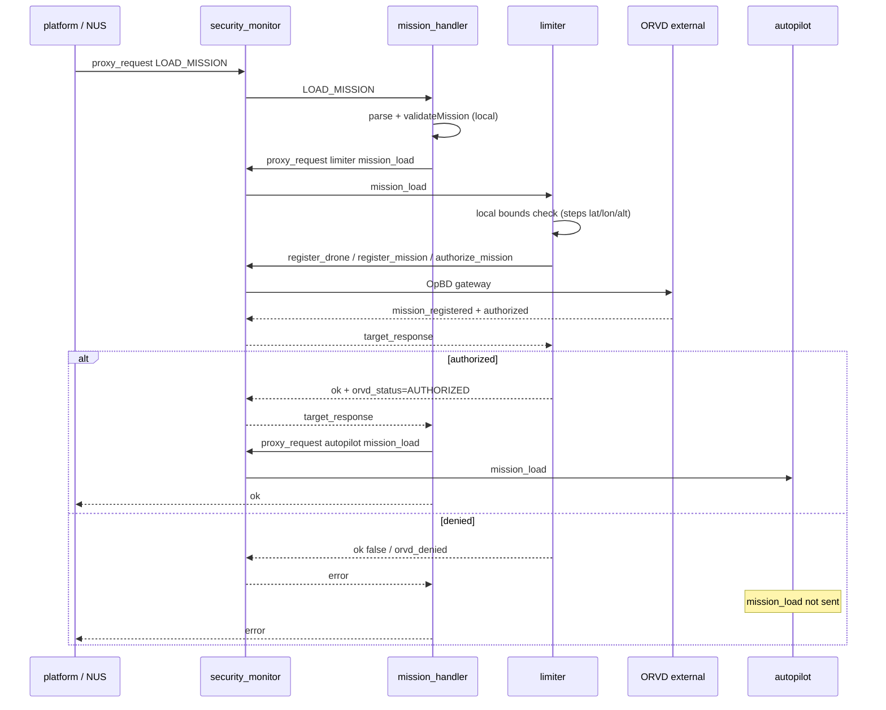
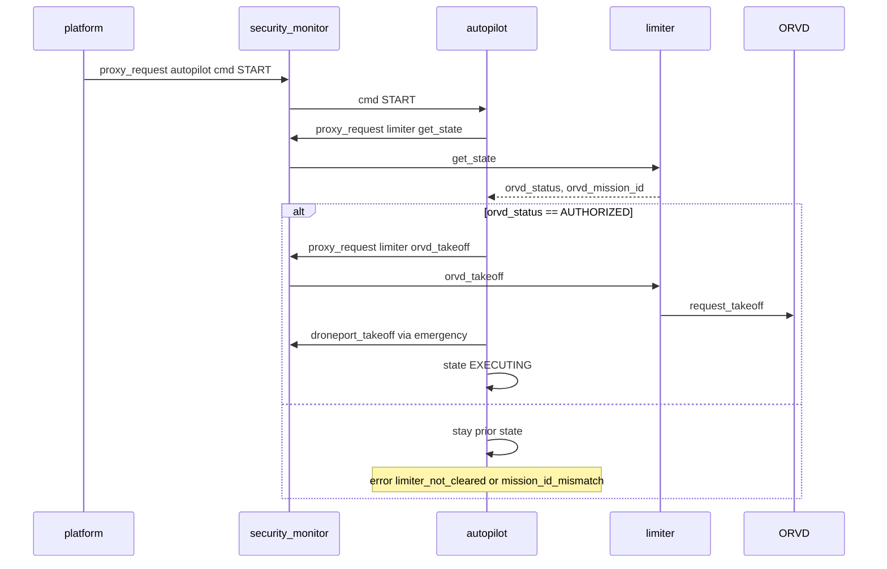

# ORVD integration for deliverydron

Date: 2026-05-18 (rev. 5 — OpBD API sync)

**Status:** ORVD integration aligned with **OpBD** (`../OpBD`) external API. Limiter runs `register_drone` → `register_mission` → `authorize_mission` at load, `request_takeoff` at preflight, in-flight `send_telemetry`, `complete_mission` on finish, and `report_incident` on emergencies. Autopilot `PRE_FLIGHT` checks limiter mission auth, then `orvd_takeoff`, then DronePort. Inbound `revoke_takeoff` and optional `update_config` supported.

This document describes how **deliverydron** integrates ORVD (ОРВД — flight authorization / airspace constraints). It follows the **context diagram** (`docs/system_description.md`: ORVD → limiter), matches **how other external modules are wired** in this repo, and uses **agrodron** (`../cyber_drons`) only as a reference — not as the target architecture.

---

## 1. Security goals and architecture fit

| Item | Implication |
|------|-------------|
| **ЦБ-3** (`report.md`) | Only ORVD-authorized missions may be executed. |
| **ЦБ-5** | Flight must stay within mission / corridor limits — **limiter** enforces deviation during flight. |
| **ЦБ-6** | External exchange via broker with integrity/authenticity (transport = infrastructure). |
| **Context diagram** | `orvd --> deliverydron.limiter` — ORVD couples to **limiter**, not autopilot. |
| **ПБ-1** | ORVD is a trusted external contour for authorization and constraint data. |

**Design choice (implemented):** **Limiter** is the single internal owner of ORVD interaction. **Autopilot does not call `ORVD_TOPIC`.** Mission acceptance and execute gating both go through limiter state.

Agrodron puts `request_takeoff` in **autopilot** pre-flight; deliverydron **intentionally diverges** to align with its diagram and limiter role.

---

## 2. How external modules are integrated (deliverydron)

### 2.1 Inbound — external → BAS via security_monitor

| External | Policy sender | Internal topic | Action | Consumer behaviour |
|----------|---------------|----------------|--------|-------------------|
| NUS / platform | `platform` | `${SYSTEM_NAME}.mission_handler` | `LOAD_MISSION` | Parse WPL/JSON, forward mission |
| SITL (telemetry path) | `sitl` | `${SYSTEM_NAME}.navigation` | `nav_state` | Update `lastState` |
| DronePort (inbound) | `droneport` | `${SYSTEM_NAME}.emergency` | `droneport_event` | Journal `DRONEPORT_EVENT_RECEIVED` |
| DronePort (preflight) | `autopilot` → `emergency` | `${SYSTEM_NAME}.emergency` | `droneport_takeoff` | Full preflight: landing + charge poll + `request_takeoff` (see [droneport_integration.md](droneport_integration.md)) |
| DronePort (return) | `autopilot` → `emergency` | `${SYSTEM_NAME}.emergency` | `droneport_land` | Post-mission `request_landing` |
| **ORVD push** | `orvd` | `${SYSTEM_NAME}.limiter` | `update_config` | Updates geofence limits; journal `ORVD_PUSH_UPDATE_CONFIG` |
| **ORVD revoke** | `orvd` | `${SYSTEM_NAME}.limiter` | `revoke_takeoff` | Journal `ORVD_REVOKE_TAKEOFF`; `limiter_event` → emergency |
| **ORVD nav pull** | `orvd` | `${SYSTEM_NAME}.navigation` | `get_state` | OpBD `request_telemetry` (read-only) |

Config: policies in `security_monitor/security_monitor.env` (and `src/security_monitor/security_monitor.env`); `${SYSTEM_NAME}` and `${ORVD_TOPIC}` expanded at runtime in `security_monitor.New()`.

### 2.2 Outbound — internal → external via env topic + proxy

| Component | Env vars | External topic | Notes |
|-----------|----------|----------------|-------|
| `motors` | `SITL_COMMANDS_TOPIC`, `SITL_DRONE_ID`, `SITL_MODE` | e.g. `sitl.commands` | Flat schema publish |
| **`limiter`** | `ORVD_TOPIC`, `ORVD_EXTERNAL_TOPIC`, `ORVD_DRONE_ID`, `LIMITER_ORVD_*` | e.g. `v1.ORVD.ORVD001.main` | `proxy_request` from limiter only |

Conventions:

- **`*_TOPIC`** — full external broker topic string.
- **`*_DRONE_ID`** — drone identity for external APIs (`ORVD_DRONE_ID`, fallback `INSTANCE_ID` if it matches `^drone_[0-9]{3,4}$`, else `drone_001`).
- **`LIMITER_ORVD_MOCK_SUCCESS`** — `1`/`true` skips ORVD RPC (CI / no OpBD container).
- **`ORVD_CERTIFICATE_ID`** — optional; when set, OpBD `register_drone` verifies via regulator.
- **Component-prefixed tuning** — `LIMITER_MAX_MISSION_ALT_M`, `LIMITER_ORVD_REQUEST_TIMEOUT_S`, `LIMITER_ORVD_TELEMETRY_INTERVAL_S`, etc.

ORVD env is set on **`limiter`** and **`security_monitor`** in `docker-compose.yml` (`ORVD_TOPIC` must be present on security_monitor so `${ORVD_TOPIC}` policy substitution works).

### 2.3 Internal mission path (implemented)

```text
platform → (SM) → mission_handler LOAD_MISSION
  → validateMission (local)
  → (SM) proxy_request → limiter mission_load   (synchronous; fail load on deny)
  → (SM) proxy_request → autopilot mission_load   (only if limiter ok)
```

`mission_handler` uses `ProxyRequest` to limiter (not `ProxyPublishAsync`). On limiter failure it logs `MISSION_HANDLER_LIMITER_ERROR` and returns the limiter error (`orvd_denied`, `mission_out_of_bounds`, etc.) without loading autopilot.

---

## 3. Reference: agrodron (`../cyber_drons`) — do not copy blindly

| Aspect | Agrodron | Deliverydron (implemented) |
|--------|----------|----------------------------|
| ORVD caller | Autopilot | **Limiter** (mission validation) |
| Diagram | Not limiter-centric | **ORVD → limiter** |
| When ORVD runs | After START | On **`mission_load`** |
| Mock env | `AUTOPILOT_ORVD_MOCK_SUCCESS` | **`LIMITER_ORVD_MOCK_SUCCESS`** |
| Geofence | Separate limiter loop | ORVD authorizes **planned** route; limiter enforces **actual** track |

Deliverydron uses the **OpBD multi-step API** (not agrodron’s single `validate_mission` stub).

---

## 4. Implemented design — limiter-centric ORVD (OpBD)

### 4.1 Responsibilities

| Layer | Responsibility |
|-------|----------------|
| **mission_handler** | Syntax/structure validation; **limiter OK** before autopilot `mission_load`. |
| **limiter** | OpBD lifecycle owner: mission load RPCs, `orvd_takeoff` / `orvd_complete`, in-flight `send_telemetry`, `report_incident`, inbound `revoke_takeoff`. |
| **autopilot** | `PRE_FLIGHT`: limiter `AUTHORIZED` → limiter `orvd_takeoff` → DronePort → `EXECUTING`; on `COMPLETED` → limiter `orvd_complete`. |
| **security_monitor** | Policies for all OpBD actions on `${ORVD_TOPIC}`; autopilot → limiter `orvd_*`; orvd → limiter `revoke_takeoff`. |
| **ORVD (OpBD)** | External gateway on `ORVD_TOPIC` (default `v1.ORVD.ORVD001.main`). Run OpBD separately; no compose profile in this repo. |

Implementation: `limiter/src/opbd_client.go`, `limiter/src/orvd.go`, `limiter/src/limiter.go`, `autopilot/src/autopilot.go`, `security_monitor/security_monitor.env`.

### 4.2 Mission load flow



**Ordering:** Limiter runs **before** autopilot; no autopilot rollback is required on ORVD denial.

### 4.3 Start / execute flow

Autopilot does **not** call ORVD. On `cmd START`, `checkLimiterAuthorizationLocked()` calls limiter `get_state` via security monitor.



`START` transitions to **`PRE_FLIGHT`** (immediate operator feedback). Preflight runs once synchronously on `START`, then the control loop polls limiter while status stays `PRE_FLIGHT` and limiter reports `PENDING`. On clearance → `EXECUTING`; on denial/timeout → `ABORTED` with `last_error` (`limiter_not_cleared`, `mission_id_mismatch`, `preflight_timeout`).

### 4.4 Local bounds check (limiter, before ORVD)

Implemented in `validateMissionBounds()` (`limiter/src/orvd.go`):

- Every step must have numeric `lat`, `lon`, `alt_m`.
- Ranges: `|lat| <= 90`, `|lon| <= 180`, `0 <= alt_m <= LIMITER_MAX_MISSION_ALT_M` (default 5000).
- Fail: `ok: false`, `error: mission_out_of_bounds`, `orvd_status = OUT_OF_BOUNDS`, journal `LIMITER_MISSION_OUT_OF_BOUNDS` — **no ORVD RPC**.

### 4.5 OpBD API mapping (deliverydron → OpBD)

| Trigger | OpBD action | Success `status` |
|---------|-------------|------------------|
| First `mission_load` (once) | `register_drone` | `registered` |
| Each `mission_load` | `register_mission` | `mission_registered` |
| Each `mission_load` | `authorize_mission` | `authorized` → limiter `AUTHORIZED` |
| Autopilot preflight | `request_takeoff` | `takeoff_authorized` |
| Control loop / after takeoff | `send_telemetry` | `telemetry_received` or `emergency`+`LAND` |
| Mission complete | `complete_mission` | `mission_completed` |
| Geofence / ORVD emergency | `report_incident` | `incident_recorded` |
| Inbound | `revoke_takeoff` | → `limiter_event` |

**`register_mission` payload** (route from mission steps):

```json
{
  "drone_id": "drone_001",
  "mission_id": "m-001",
  "route": [ { "lat": 55.75, "lon": 37.61 } ],
  "time": "2026-05-18T12:00:00Z"
}
```

**Denial:** `rejected`, `takeoff_denied`, `error` → mission load or takeoff denied.

Journal: `ORVD_DRONE_REGISTERED`, `ORVD_MISSION_REGISTERED`, `ORVD_MISSION_AUTHORIZED`, `ORVD_TAKEOFF_AUTHORIZED`, `ORVD_MISSION_COMPLETED`, `ORVD_ZONE_VIOLATION`, `ORVD_REVOKE_TAKEOFF`, `LIMITER_MISSION_OUT_OF_BOUNDS`.

### 4.6 Inbound ORVD → limiter (implemented)

ORVD (or a gateway) publishes to `${SYSTEM_NAME}.limiter` with action **`update_config`** and sender **`orvd`**. Limiter accepts `security_monitor` and `orvd` senders. Payload may use top-level or nested `constraints` keys (`max_distance_from_path_m`, `max_alt_deviation_m`). Journal: `ORVD_PUSH_UPDATE_CONFIG`.

Broker ACL must restrict who may use sender id `orvd` on the limiter topic.

### 4.7 Configuration

| Variable | Service | Purpose |
|----------|---------|---------|
| `ORVD_TOPIC` | limiter, **security_monitor** | External ORVD API topic; empty = skip ORVD RPC. |
| `ORVD_EXTERNAL_TOPIC` | limiter, security_monitor | Alias for `ORVD_TOPIC`. |
| `ORVD_DRONE_ID` | limiter | Drone id in ORVD payloads (default `drone_001` or valid `INSTANCE_ID`). |
| `LIMITER_ORVD_MOCK_SUCCESS` | limiter | `1`/`true` — skip ORVD RPC, stub authorize. |
| `ORVD_CERTIFICATE_ID` | limiter | Optional regulator cert on `register_drone`. |
| `ORVD_DRONE_MODEL`, `ORVD_OPERATOR` | limiter | Optional metadata for `register_drone`. |
| `LIMITER_ORVD_REQUEST_TIMEOUT_S` | limiter | ORVD proxy timeout; falls back to `LIMITER_REQUEST_TIMEOUT_S`. |
| `LIMITER_ORVD_TELEMETRY_INTERVAL_S` | limiter | In-flight `send_telemetry` rate (default 1s). |
| `LIMITER_MAX_MISSION_ALT_M` | limiter | Max step altitude for local bounds (default 5000). |
| `LIMITER_TOPIC` | autopilot | Optional override for limiter topic. |
| `AUTOPILOT_PREFLIGHT_TIMEOUT_S` | autopilot | Max time in `PRE_FLIGHT` before `ABORTED` / `preflight_timeout` (default 60; 0 = no timeout). |

**ORVD disabled (`ORVD_TOPIC` empty):** limiter skips external RPC and sets `orvd_status` to **`AUTHORIZED`** after bounds pass (so autopilot `START` gate stays simple). Initial limiter state at startup is `DISABLED` until the first `mission_load`.

**`docker-compose.yml`:**

- `security_monitor`: `ORVD_TOPIC`, `ORVD_EXTERNAL_TOPIC` (policy substitution only).
- `limiter`: full `ORVD_*` and `LIMITER_ORVD_*` / `LIMITER_MAX_MISSION_ALT_M`.

### 4.8 Security policies (implemented)

`${ORVD_TOPIC}` is replaced in `security_monitor.New()` from `ORVD_TOPIC` / `ORVD_EXTERNAL_TOPIC` env (same pattern as `${SYSTEM_NAME}`).

Rows in `security_monitor/security_monitor.env`:

```json
{ "sender": "limiter", "topic": "${ORVD_TOPIC}", "action": "register_drone" }
{ "sender": "limiter", "topic": "${ORVD_TOPIC}", "action": "register_mission" }
{ "sender": "limiter", "topic": "${ORVD_TOPIC}", "action": "authorize_mission" }
{ "sender": "limiter", "topic": "${ORVD_TOPIC}", "action": "request_takeoff" }
{ "sender": "limiter", "topic": "${ORVD_TOPIC}", "action": "send_telemetry" }
{ "sender": "limiter", "topic": "${ORVD_TOPIC}", "action": "complete_mission" }
{ "sender": "limiter", "topic": "${ORVD_TOPIC}", "action": "report_incident" }
{ "sender": "autopilot", "topic": "${SYSTEM_NAME}.limiter", "action": "get_state" }
{ "sender": "autopilot", "topic": "${SYSTEM_NAME}.limiter", "action": "orvd_takeoff" }
{ "sender": "autopilot", "topic": "${SYSTEM_NAME}.limiter", "action": "orvd_complete" }
{ "sender": "mission_handler", "topic": "${SYSTEM_NAME}.limiter", "action": "mission_load" }
{ "sender": "orvd", "topic": "${SYSTEM_NAME}.limiter", "action": "revoke_takeoff" }
```

If `ORVD_TOPIC` is empty at deploy time, the limiter→ORVD rows expand to an empty topic and will not match real traffic until ORVD is configured and policies are regenerated.

```json
{ "sender": "orvd", "topic": "${SYSTEM_NAME}.limiter", "action": "update_config" }
```

### 4.9 Limiter state (`get_state`)

```json
{
  "state": "NORMAL",
  "orvd_status": "AUTHORIZED",
  "orvd_mission_id": "m-001",
  "orvd_phase": "TAKEOFF_AUTHORIZED",
  "orvd_takeoff_authorized": true,
  "mission_loaded": true,
  "max_distance_from_path_m": 50,
  "max_alt_deviation_m": 20
}
```

`orvd_status`: `DISABLED`, `PENDING`, `AUTHORIZED`, `DENIED`, `OUT_OF_BOUNDS`. `orvd_phase`: `DRONE_REGISTERED`, `MISSION_REGISTERED`, `AUTHORIZED`, `TAKEOFF_AUTHORIZED`, `COMPLETED`, `DENIED`.

Re-validated on each `mission_load` with a new `mission_id`. Mission is stored in limiter only when status is `AUTHORIZED`.

---

## 5. What not to do

| Anti-pattern | Why |
|--------------|-----|
| Autopilot → `ORVD_TOPIC` directly | Bypasses limiter; contradicts context diagram. |
| `AUTOPILOT_ORVD_MOCK_SUCCESS` on deliverydron | Use `LIMITER_ORVD_MOCK_SUCCESS` on limiter. |
| Fire-and-forget `mission_load` to limiter with ORVD | Operator sees success while ORVD denied (removed in v1). |
| Authorize on `START` only, not on mission | Allows loading a bad mission into autopilot (agrodron Attack 2). |

---

## 6. Implementation record (v1)

| Step | Component | Status | Location |
|------|-----------|--------|----------|
| 1 | `limiter` | Done | Local bounds in `orvd.go` / `handleMissionLoad` |
| 2 | `limiter` | Done | `requestORVDValidation()` + env in `orvd.go` |
| 3 | `limiter` | Done | `orvd_status` / `orvd_mission_id` in `get_state` |
| 4 | `limiter` | Done | Journal events for ORVD / bounds |
| 5 | `mission_handler` | Done | `ProxyRequest` to limiter; fail on deny |
| 6 | `mission_handler` | Done | Order: limiter → autopilot |
| 7 | `autopilot` | Done | `START` gate via limiter `get_state`; `last_error` |
| 8 | `security_monitor` | Done | Policies + `${ORVD_TOPIC}` substitution |
| 9 | `docker-compose.yml` | Done | ORVD env on **limiter** and **security_monitor** |
| 10 | `security_monitor.env` | Done | Both `security_monitor/` and `src/security_monitor/` |
| 11 | `tests` | Done | `tests/module_orvd_test.go` |
| 12 | `tests` | Done | Mission handler / autopilot ORVD scenarios in same file |
| 13 | `docs` | Done | This document; `system_description.md` diagram unchanged |

### Phase 2 (implemented)

| Item | Status | Notes |
|------|--------|-------|
| Inbound `orvd` → limiter `update_config` | Done | Policy row in `security_monitor.env`; limiter trusts sender `orvd` |
| Autopilot `PRE_FLIGHT` + limiter polling | Done | Sync check on `START`; control loop polls while `PENDING` |

### Phase 3 (implemented)

| Item | Status | Notes |
|------|--------|-------|
| DronePort lifecycle | Done | `emergency` full sync: `request_landing`, orchestrator `get_available_drones`, `request_takeoff`, `droneport_land`; see [droneport_integration.md](droneport_integration.md) |
| `orvd_stub` (agrodron) | Done | `cyber_drons/src/orvd_stub` — external ORVD API simulator for `validate_mission` / `request_takeoff` |
| Agrodron limiter ORVD | Done | `limiter/src/orvd.py`; mission_handler loads limiter first |
| Agrodron autopilot | Done | `LIMITER_ORVD_PREFLIGHT=1` (default): PRE_FLIGHT uses limiter `get_state` instead of direct ORVD |

---

## 7. Testing

Tests live in `tests/module_orvd_test.go`. Existing mission-handler tests reply to limiter `mission_load` with `{ok: true, orvd_status: AUTHORIZED}`.

Run:

```bash
go test ./tests -run ORVD -count=1
go test ./tests -count=1
```

| Scenario | Expected |
|----------|----------|
| Invalid `alt_m` vs `LIMITER_MAX_MISSION_ALT_M` | `mission_out_of_bounds`, no ORVD handler call |
| ORVD handler returns `mission_authorized` | `mission_load` ok; `get_state.orvd_status == AUTHORIZED` |
| ORVD handler returns `denied` | `mission_load` ok false; mission_handler does not load autopilot |
| `LIMITER_ORVD_MOCK_SUCCESS=1` | No ORVD handler; `AUTHORIZED` |
| Empty `ORVD_TOPIC` | No ORVD RPC; after successful load, `AUTHORIZED` (not `DISABLED`) |
| Autopilot `START` without limiter auth | `ok: false`, `limiter_not_cleared` |
| After full load via mission_handler + ORVD approve | `START` → `EXECUTING` |
| `limiter` → ORVD without policy | `proxy_request` forbidden |

---

## 8. File map

| File | Role |
|------|------|
| `limiter/src/orvd.go` | ORVD config, bounds validation, RPC, response parsing |
| `limiter/src/limiter.go` | `handleMissionLoad`, `get_state`, ORVD state fields |
| `mission_handler/src/mission_handler.go` | Synchronous limiter-first load |
| `autopilot/src/autopilot.go` | `START` gate, `last_error`, `LIMITER_TOPIC` |
| `security_monitor/src/security_monitor.go` | `${ORVD_TOPIC}` policy substitution |
| `security_monitor/security_monitor.env` | Policy rows (keep in sync with `src/security_monitor/`) |
| `docker-compose.yml` | ORVD env on limiter + security_monitor |
| `tests/module_orvd_test.go` | ORVD module tests |
| `tests/integration_mission_handler_test.go` | Limiter stub replies to `mission_load` |
| `tests/module_mission_handler_extra_test.go` | Same for autopilot-error path |

Reference only: `cyber_drons/src/autopilot/src/autopilot.py`, `config.py`.

---

## 9. Decision summary

| Question | Answer |
|----------|--------|
| Who talks to ORVD? | **Limiter only** (outbound `proxy_request`). |
| Who talks to limiter about ORVD? | **mission_handler** (`mission_load`), **autopilot** (`get_state` before execute). |
| External topic? | **`ORVD_TOPIC`** env (full broker name). |
| When is ORVD consulted? | On **`mission_load`**, before autopilot load. |
| Dev without ORVD? | Empty `ORVD_TOPIC` and/or **`LIMITER_ORVD_MOCK_SUCCESS=1`**. |
| Agrodron autopilot ORVD? | **Reference only** — not the deliverydron integration shape. |
| Diagram `ORVD → limiter`? | **Authoritative** for deliverydron. |
| v1–v3 complete? | **Yes** — deliverydron + agrodron alignment; see §6 and Phase 3 table. |

### DronePort

See **[droneport_integration.md](droneport_integration.md)** for env vars, phases, and API details.

This design satisfies **ЦБ-3** at mission acceptance time, strengthens **ЦБ-5** with local bounds plus runtime limiter, and stays consistent with **platform / SITL / proxy / env** patterns already used in the repo.
