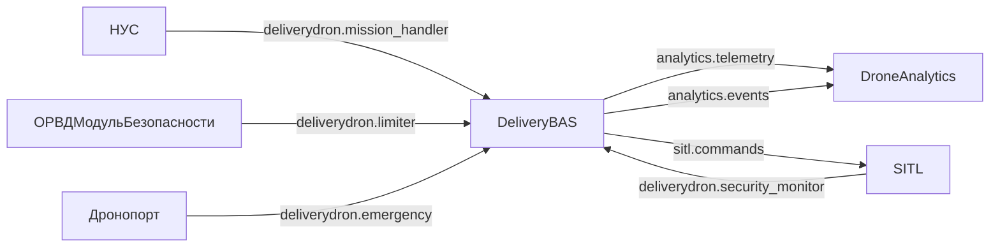
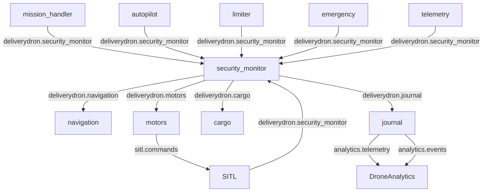
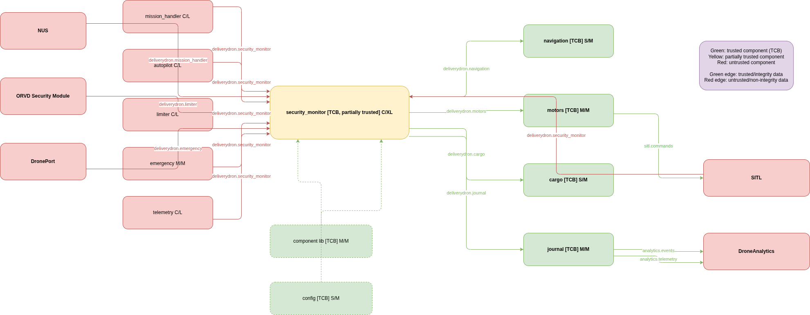

# Описание системы и кибериммунной архитектуры (актуализация)

Дата актуализации: 18 мая 2026

---

## 0) Контекстная диаграмма и функциональная архитектура

### 0.1 Контекстная диаграмма



### 0.2 Функциональная архитектура системы



### 0.3 Диаграмма архитектуры политики



---

## 1) ЦБПБ

### 1.1 Цели безопасности (ЦБ)
1. К критичным компонентам БАС допускаются только аутентичные и авторизованные сообщения.
1. Все межкомпонентные критичные операции являются авторизованными.
1. Обрабатываются только авторизованные, корректно адресованные и разрешённые сообщения.
1. Критичные исполнительные компоненты `navigation`, `motors`, `cargo` выполняют только авторизованные операции.

### 1.2 Предположения безопасности (ПБ)
1. Бизнес-валидность payload команд обеспечивается внешними доверенными контурами.
2. Аварийная логика детекции/реакции верифицируется вне message-control/исполнительного trust-контура.
3. Защита транспортного канала (К/Ц/П) обеспечивается инфраструктурой защищённой связи.

---

## 2) Архитектура политики, уровни доверия и оценка доменов

**Артефакты по ТЗ:** [БТ3 — активы и домены](bts3_assets_and_trust_model.md) · [БТ6 — целостность и зависимости](bts6_integrity_coverage_and_dependencies.md) · [Защита топиков брокера](broker_topic_auth.md)

### 2.1 Архитектура политики

- `security_monitor` реализует policy enforcement для `proxy_request`/`proxy_publish`.
- Политики задаются списком `(sender, topic, action)`.
- При переходе в `ISOLATED` активируется аварийный набор политик, при `ISOLATION_END` восстанавливаются базовые политики.
- Deny-by-default: отсутствие правила = запрет.

**Ссылка на политики безопасности:**
- [`security_monitor/security_monitor.env`](../security_monitor/security_monitor.env)
- дублирующая сборочная копия: [`src/security_monitor/security_monitor.env`](../src/security_monitor/security_monitor.env)

### 2.2 Обоснование уровней доверия (по угрозам и путям атак)

- **L0 (недоверенный ввод):** любые внешние/межсервисные сообщения до проверки.
  - Угроза: подмена sender, навязывание команды.
  - Контроль: централизованный policy check в `security_monitor`.
- **L1 (условно доверенный отправитель):** sender, разрешённый политикой для конкретного `(topic, action)`.
  - Угроза: злоупотребление разрешённым каналом.
  - Контроль: точное сопоставление sender + action/topic + режим isolation.
- **L2 (доверенный механизм управления состоянием безопасности):** `security_monitor` как держатель `NORMAL/ISOLATED`.
  - Угроза: обход режима isolation.
  - Контроль: аварийные политики + переходы `ISOLATION_START/END`, watchdog-failsafe.
- **L3 (доверенный аудит):** `journal` как самописец решений allow/deny и переходов.
  - Угроза: потеря/подмена следов.
  - Контроль: централизованная запись security-событий, проверка в тестах.
- **L4 (доверенные исполнительные модули):** `navigation`, `motors`, `cargo` как часть ДВБ для критичных операций.
  - Угроза: исполнение команды в обход policy-gate.
  - Контроль: mediation-only доступ через `security_monitor` + тесты разрешенных/запрещенных сценариев.

### 2.3 Оценка доменов безопасности по размеру и сложности

Метрика размера: непустые строки Go-кода (`*.go`), без `vendor`, `tests`, `.generated`, `*_test.go`.

#### ДВБ для текущих ЦБПБ (message-control + trusted executors TCB)

- `security_monitor` — 617 LOC (87%) (высокая сложность)
- `component` — 278 LOC (80%) (средняя сложность)
- `config` — 155 LOC (99%) (низкая/средняя сложность)
- `journal` — 188 LOC (81%) (средняя сложность)
- `navigation` — 139 LOC (90%) (низкая/средняя сложность)
- `motors` — 206 LOC (84%) (средняя сложность)
- `cargo` — 151 LOC (93%) (низкая/средняя сложность)

**Итого ДВБ: 1734 LOC (88% покрыто тестами)**

#### Вне ДВБ в текущей постановке ЦБПБ

`autopilot`, `mission_handler`, `limiter`, `emergency`, `telemetry`, `bus`, `sdk`, `delivery*`, `stub_component` — вынесены в предположения безопасности/внешние контуры ответственности для данного scope.

---

## 3) Внедрённые шаблоны СКИБ

1. **Reference Monitor / Policy Enforcement Point**  
   `security_monitor` — единая точка mediating доступа.
2. **Mediation-only access**  
   Критичные операции идут через `proxy_request`/`proxy_publish`.
3. **Fail-safe default**  
   Нет разрешающей политики -> отказ (`forbidden`).
4. **Dedicated Safety-State Mechanism**  
   Централизованное состояние безопасности (`NORMAL/ISOLATED`) и управляемые переходы `ISOLATION_START/ISOLATION_END`.
5. **Defense in Depth (внутри message-control + executors контура)**  
   Policy check + exact sender match + isolation mode + trusted executors + audit trail.

### 3.1 Сопоставление с ГОСТ Р 72118—2025 (приложение А)

Реализованные шаблоны приложения А и их привязка к коду:

| Шаблон ГОСТ | Реализация |
|-------------|------------|
| **A.1** Монитор | `limiter` — опрос navigation/telemetry, `limiter_event`; `emergency` — изоляция, cargo, LAND; `journal` — запись событий |
| **A.2** Раздельное принятие и применение решений | `security_monitor`: политика `(sender, topic, action)`, allow/deny; применение — `proxy_request` / `proxy_publish` через `component.ProxyClient` |
| **A.3** Иерархия доверия | Уровни L0–L4 (§2.2), проверка `IsTrustedSender`, фиксированный отправитель `security_monitor` для исполнителей |
| **A.5** Обработка входных данных | `mission_handler` — разбор и проверка WPL/JSON; `limiter` — геозоны и ограничения миссии |
| **A.6** Механизм состояния безопасности | `NORMAL` / `ISOLATED`, `ISOLATION_START` / `ISOLATION_END`, аварийные политики, watchdog в `security_monitor` |
| **A.9** Безопасная регистрация | `journal`: `LOG_EVENT` только от `security_monitor`, NDJSON, `inferSeverity`, пересылка в DroneAnalytics |

Паттерны §3: Reference Monitor / PEP и mediation-only → **A.2**; fail-safe default; Dedicated Safety-State → **A.6**; Defense in Depth — `security_monitor` + политики + `limiter` + `journal` + isolation.

---

## Проверка соответствия политик архитектуре

Совместно с тестовым контуром выполнена проверка policy-сценариев:

- `go test ./tests -run 'SecurityMonitor|Safety|Integration_MissionHandler_ProxyPolicy|Integration_Cargo_Journal' -count=1`
- Результат: **PASS** (`ok .../tests`).

Покрыто:
- deny-by-default;
- разрешённая проксируемая публикация/запрос;
- переход в `ISOLATED` и аварийные разрешения;
- восстановление в `NORMAL` (`ISOLATION_END`);
- контроль trusted sender и журналирование security-событий.

---

## 4) Покрытие тестами по компонентам

Метрика: **покрытие операторов (statements)** в пакетах `*/src` (без `cmd/*` и `tests/e2e`).  
Профили интеграционных (`./tests`) и модульных (`*/src/*_test.go`) тестов объединяются через `gocovmerge`.

Дата замера: 18 мая 2026.

| Компонент | Покрытие | Покрыто / всего |
|-----------|----------|-----------------|
| emergency | 73.4% | 282 / 384 |
| limiter | 78.6% | 408 / 519 |
| autopilot | 79.1% | 318 / 402 |
| mission_handler | 79.7% | 161 / 202 |
| component | 80.2% | 85 / 106 |
| journal | 81.2% | 78 / 96 |
| motors | 83.5% | 96 / 115 |
| security_monitor | 87.3% | 268 / 307 |
| telemetry | 87.8% | 137 / 156 |
| navigation | 89.6% | 43 / 48 |
| sdk | 91.6% | 76 / 83 |
| cargo | 93.2% | 41 / 44 |
| delivery | 93.2% | 41 / 44 |
| config | 98.8% | 79 / 80 |
| bus | 100.0% | 14 / 14 |
| **Итого** | **81.8%** | **2127 / 2600** |

Компоненты ниже целевого порога 80%: `emergency`, `limiter`, `autopilot`, `mission_handler`.

### Воспроизведение замера

```bash
export PATH="$HOME/go/bin:$PATH"   # gocovmerge: go install github.com/wadey/gocovmerge@latest

COVERPKG=$(go list ./... | grep '/src$' | grep -v e2e | tr '\n' ',' | sed 's/,$//')

go test ./tests -count=1 -timeout 120s \
  -coverprofile=/tmp/cov_int.out -covermode=count -coverpkg="$COVERPKG"

go test ./bus/src ./component/src ./config/src ./sdk/src ./journal/src \
  ./telemetry/src ./motors/src ./emergency/src ./autopilot/src \
  ./limiter/src ./mission_handler/src -count=1 -timeout 90s \
  -coverprofile=/tmp/cov_unit.out -covermode=count -coverpkg="$COVERPKG"

gocovmerge /tmp/cov_int.out /tmp/cov_unit.out > coverage_merged.out
go tool cover -func=coverage_merged.out | tail -1
```

Запуск всех тестов (без e2e):

```bash
go test $(go list ./... | grep -v e2e) -count=1 -timeout 120s
```
